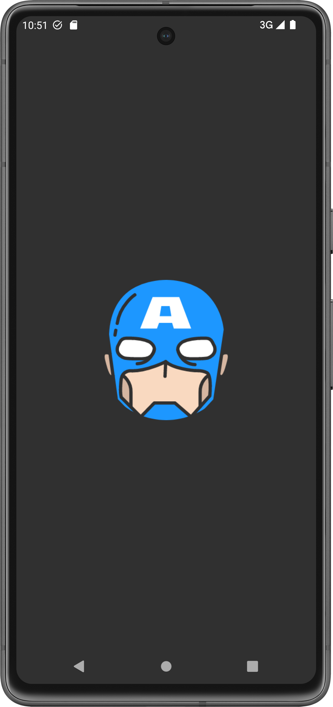
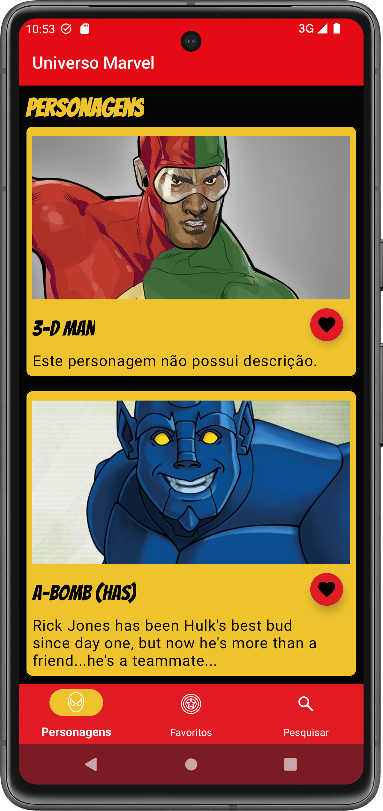
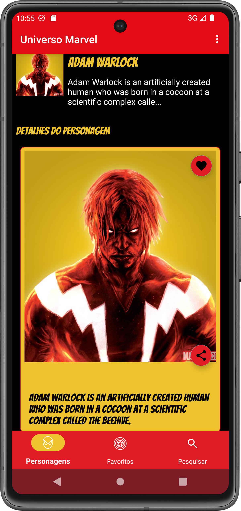
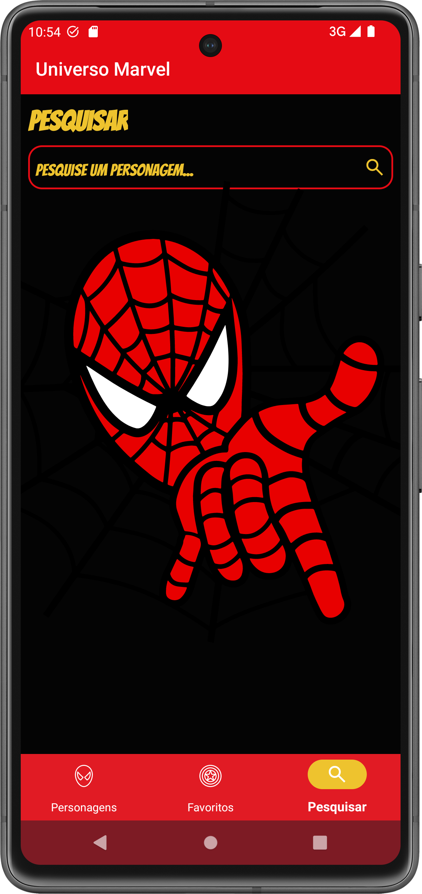
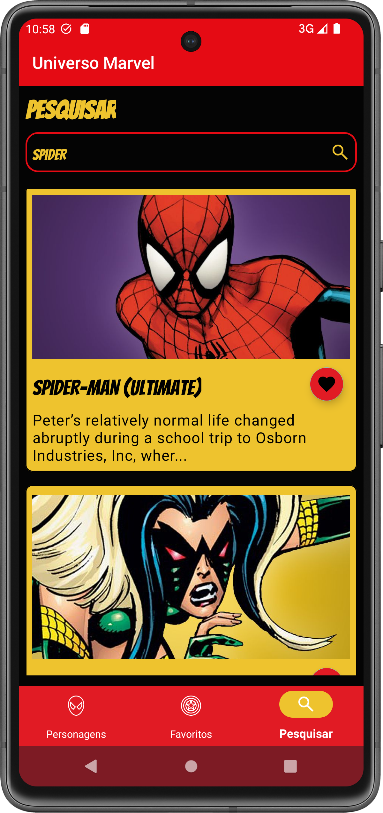
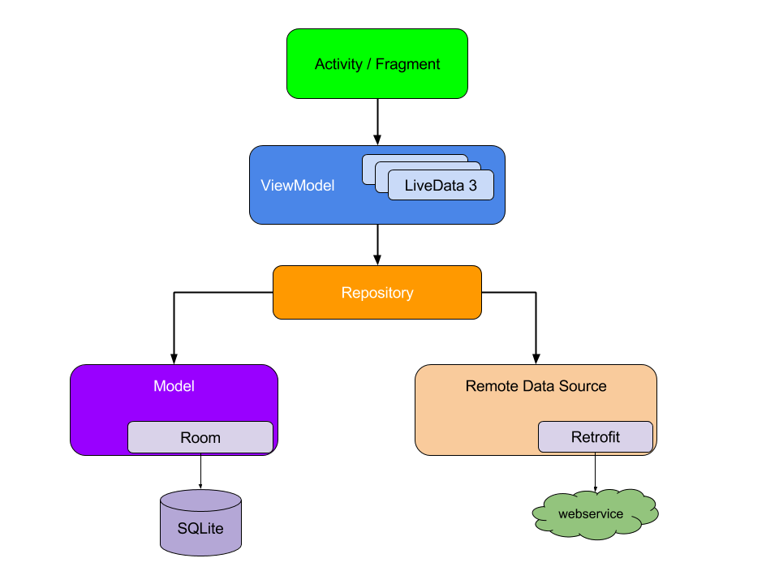
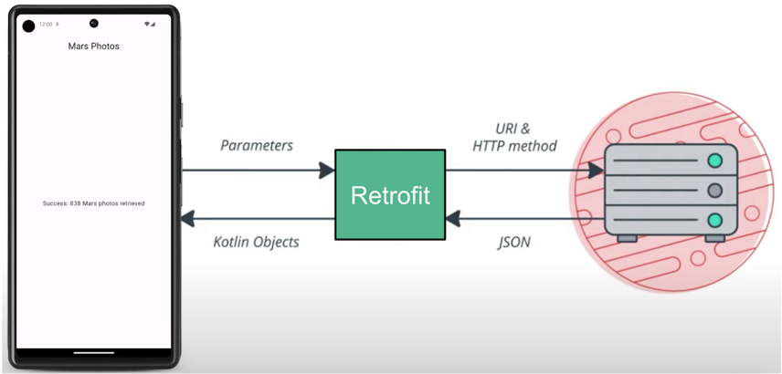

# Marvel-App
Aplicativo android nativo que traz uma lista de personagens da Marvel e permite fazer pesquisas, favoritar e excluir os personagens salvos. 

## :camera_flash: Screenshots

&emsp;&emsp;&emsp;

&emsp;&emsp;

## :movie_camera: Video
&emsp;&emsp;


## :hammer_and_wrench: Tecnologias utilizadas
* Kotlin
* Clean Architecture
* Kotlin
* MVVM
* Retrofit
* Dagger Hilt
* Coroutines
* Glide
* Flow 
* State Flow
* Room Database
* Jetpack Components(ViewBinding, Navigation Components)

## :bookmark_tabs: Conceitos

* Kotlin:
    - Linguagem de programação moderna e estaticamente tipada com suporte total ao desenvolvimento para Android.
 
  
* Clean Architecture:
    - Separação de conceitos;
    - Interface com base em modelos de dados;
    - Única fonte de informações;
    - Fonte: https://developer.android.com/topic/architecture?hl=pt-br
 
* MVVM:
    - Separação de responsabilidades;
    - Facilidade de manutenção;
    - Testabilidade.
  

* Room Database
    - A biblioteca de persistência Room oferece uma camada de abstração sobre o SQLite para permitir acesso fluente ao banco de dados, aproveitando toda a capacidade do SQLite.A persistência de dados local pode ser muito útil para apps que processam quantidades não triviais de dados estruturados. O caso de uso mais comum é armazenar em cache partes importantes de dados para que, quando o dispositivo não puder acessar a rede, o usuário ainda consiga ter acesso a esse conteúdo off-line.
    - 
    -  

* Retrofit:
  - Biblioteca para se conectar a um serviço REST da Web e receber uma resposta.
  - Fonte: https://square.github.io/retrofit.
  - 

* Serialization
  - Analisa a resposta JSON em um objeto de dado
  - Fonte: https://kotlinlang.org/docs/serialization.html#0


* Dagger Hilt
  - Biblioteca de injeção de dependência para Android que reduz a injeção manual de código boilerplate no projeto, oferecendo contêineres para cada classe do Android e gerenciando os ciclos de vida de cada uma automaticamente. 
  - Fonte: ttps://developer.android.com/training/dependency-injection/hilt-android?hl=pt-br
 

* Coroutines
  - Padrão de projeto de simultaneidade para simplificar o código que é executado de forma assíncrona. As corrotinas ajudam a gerenciar tarefas de longa duração que podem bloquear a linha de execução principal e fazer com que seu app pare de responder.
  - Fonte: https://developer.android.com/kotlin/coroutines?hl=pt-br
 

* Flow 
  - Em corrotinas, um fluxo é um tipo que pode emitir vários valores sequencialmente. Conceitualmente, um fluxo é um stream de dados que pode ser computado de forma assíncrona.
  - Fonte:https://developer.android.com/kotlin/flow?hl=pt-br

* StateFlow
  - É um fluxo observável detentor de estado que emite as atualizações de estado novas e atuais para os coletores. No Android, StateFlow é uma ótima opção para classes que precisam manter um estado mutável observável.
  - Fonte: https://developer.android.com/kotlin/flow/stateflow-and-sharedflow?hl=pt-br
 
* Data Binding(ViewBinding)
  - É uma biblioteca de suporte que permite vincular componentes de interface nos seus layouts a fontes de dados no app usando um formato declarativo em vez de programaticamente.
  - Fonte:https://developer.android.com/topic/libraries/data-binding?hl=pt-br
 
* Glide 
  - É uma estrutura de gerenciamento de mídia e carregamento de imagens de código aberto rápida e eficiente para Android que envolve decodificação de mídia, cache de memória e disco e pool de recursos em uma interface simples e fácil de usar.
  - Fonte:https://github.com/bumptech/glide

* Timber 
  - Um logger com uma API pequena e extensível que fornece utilidade além da Logclasse normal do Android.
  - Fonte:https://github.com/JakeWharton/timber
 
* Secrets Gradle Plugin for Android
  - A inclusão de chaves de API ao código-fonte expõe chaves em repositórios públicos, exemplos de código compartilhados e arquivos compartilhados por acidente. Uma alternativa é utilizar o secrets-gradle-plugin para proteger chaves de API no seu projeto.
  - Fonte:https://github.com/google/secrets-gradle-plugin
 
### :pushpin:  TODO
- Ativar o botão para favoritar nas células.
- Compartilhar a imagem do personagem.
- Interface de erro ou sem internet.


## :woman_technologist: Setup
* Faça o fork e o clone do projeto
* Gere sua Api Key (https://developer.marvel.com/documentation/getting_started)

* De acordo com a documentação, você vai precisar utilizar os seguintes parâmetros:
   - Timestamp,;
   - ApiKey (Your Public Key);
   - e Hash.
   - Fonte: https://developer.marvel.com/documentation/authorization. 

 ```
publicKey="Sua_chave_publica"
privateKey="Sua_ chave_privada"
```

* Faça um rebuild no projeto. 
* Feito isso, você estará pronto para fazer uma versão do seu projeto 😃.

  
## Author
Aline Ferreira (follow me on [LinkedIn](https://www.linkedin.com/in/ferreiraline/))

## License
```
The MIT License (MIT)

Copyright (c) 2024 Aline Ferreira

Permission is hereby granted, free of charge, to any person obtaining a copy of
this software and associated documentation files (the "Software"), to deal in
the Software without restriction, including without limitation the rights to
use, copy, modify, merge, publish, distribute, sublicense, and/or sell copies of
the Software, and to permit persons to whom the Software is furnished to do so,
subject to the following conditions:

The above copyright notice and this permission notice shall be included in all
copies or substantial portions of the Software.

THE SOFTWARE IS PROVIDED "AS IS", WITHOUT WARRANTY OF ANY KIND, EXPRESS OR
IMPLIED, INCLUDING BUT NOT LIMITED TO THE WARRANTIES OF MERCHANTABILITY, FITNESS
FOR A PARTICULAR PURPOSE AND NONINFRINGEMENT. IN NO EVENT SHALL THE AUTHORS OR
COPYRIGHT HOLDERS BE LIABLE FOR ANY CLAIM, DAMAGES OR OTHER LIABILITY, WHETHER
IN AN ACTION OF CONTRACT, TORT OR OTHERWISE, ARISING FROM, OUT OF OR IN
CONNECTION WITH THE SOFTWARE OR THE USE OR OTHER DEALINGS IN THE SOFTWARE.
```
